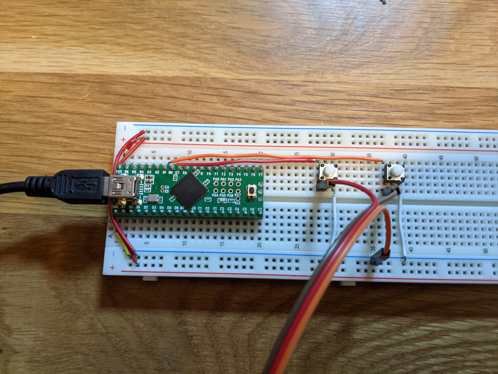

# Teensy Morse Code Controller for VBand

It's cheaper to buy their "USB paddle interface". I had a teensy sitting around and thought I'd make my own.

https://hamradio.solutions/vband/

## Pictures

