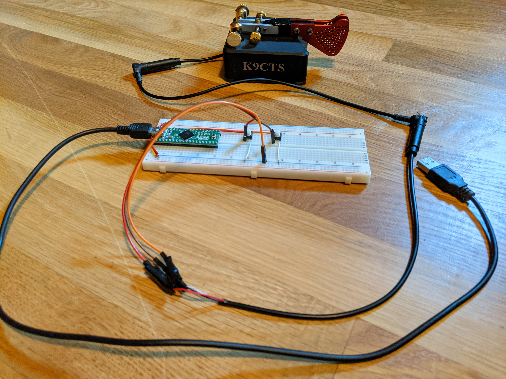

# Teensy USB Paddle Interface for VBand Morse Code Practice

It's cheaper to buy vband's "USB paddle interface". I had a teensy sitting around and thought I'd make my own.

https://hamradio.solutions/vband/

## Pictures

